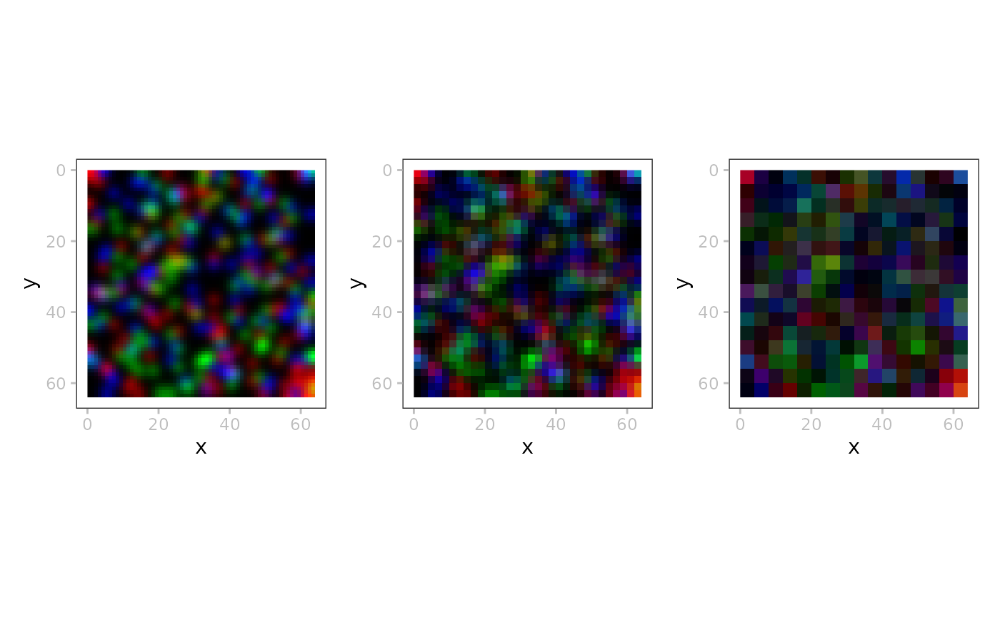
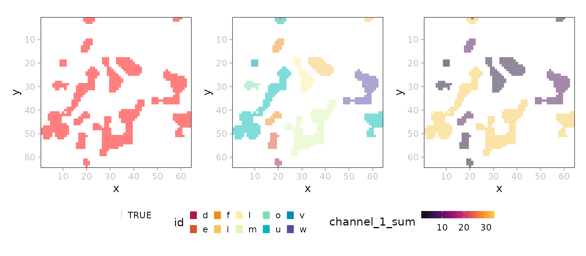
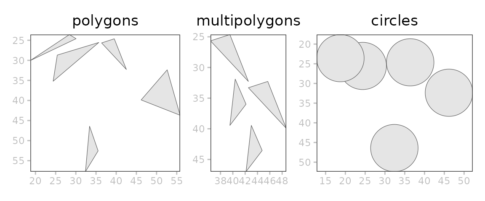
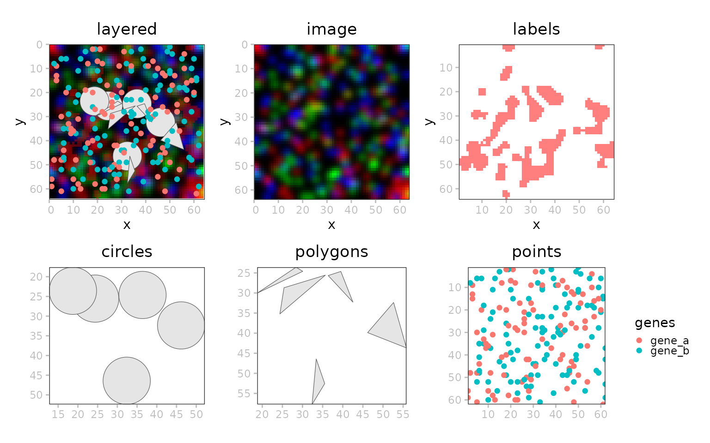
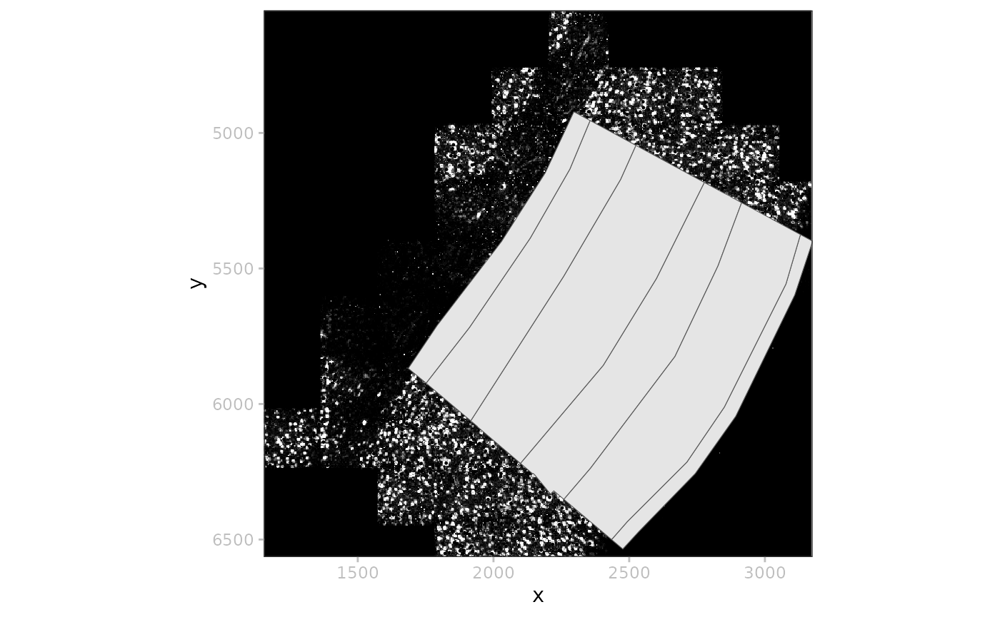

# \`SpatialData.plot\`

``` r

library(ggplot2)
library(patchwork)
library(ggnewscale)
library(SpatialData)
library(SpatialData.data)
library(SpatialData.plot)
library(SingleCellExperiment)
```

## Introduction

The `SpatialData` package contains a set of reader and plotting
functions for spatial omics data stored as
[SpatialData](https://spatialdata.scverse.org/en/latest/index.html)
`.zarr` files that follow [OME-NGFF
specs](https://ngff.openmicroscopy.org/latest/#image-layout).

Each `SpatialData` object is composed of five layers: images, labels,
shapes, points, and tables. Each layer may contain an arbitrary number
of elements.

Images and labels are represented as `ZarrArray`s
(*[Rarr](https://bioconductor.org/packages/3.23/Rarr)*). Points and
shapes are represented as
*[arrow](https://CRAN.R-project.org/package=arrow)* objects linked to an
on-disk *.parquet* file. As such, all data are represented out of
memory.

Element annotation as well as cross-layer summarizations (e.g., count
matrices) are represented as
*[SingleCellExperiment](https://bioconductor.org/packages/3.23/SingleCellExperiment)*
as tables.

``` r

x <- file.path("extdata", "blobs.zarr")
x <- system.file(x, package="SpatialData")
(x <- readSpatialData(x))
```

    ## class: SpatialData
    ## - images(2):
    ##   - blobs_image (3,64,64)
    ##   - blobs_multiscale_image (3,64,64)
    ## - labels(2):
    ##   - blobs_labels (64,64)
    ##   - blobs_multiscale_labels (64,64)
    ## - points(1):
    ##   - blobs_points (200)
    ## - shapes(3):
    ##   - blobs_circles (5,circle)
    ##   - blobs_multipolygons (2,polygon)
    ##   - blobs_polygons (5,polygon)
    ## - tables(1):
    ##   - table (3,10) [blobs_labels]
    ## coordinate systems(5):
    ## - global(8): blobs_image blobs_multiscale_image ... blobs_polygons
    ##   blobs_points
    ## - scale(1): blobs_labels
    ## - translation(1): blobs_labels
    ## - affine(1): blobs_labels
    ## - sequence(1): blobs_labels

## Visualization

#### Images

`Image/LabelArray`s are linked to potentially multiscale .zarr stores.
Their show method includes the scales available for a given element:

``` r

image(x, "blobs_image")
```

    ## class:  SpatialDataImage  
    ## Scales (1): (3,64,64)

``` r

image(x, "blobs_multiscale_image")
```

    ## class:  SpatialDataImage (MultiScale) 
    ## Scales (3): (3,64,64 3,32,32 3,16,16)

Internally, multiscale `ImageArray`s are stored as a list of
`ZarrArray`, e.g.:

``` r

i <- image(x, "blobs_multiscale_image")
vapply(i@data, dim, numeric(3))
```

    ##      [,1] [,2] [,3]
    ## [1,]    3    3    3
    ## [2,]   64   32   16
    ## [3,]   64   32   16

To retrieve a specific scale’s `ZarrArray`, we can use `data(., k)`,
where `k` specifies the target scale. This also works for plotting:

``` r

wrap_plots(nrow=1, lapply(seq(3), \(.) 
    plotSpatialData() + plotImage(x, i=2, k=.)))
```



#### Labels

``` r

i <- "blobs_labels"
t <- getTable(x, i)
t$id <- sample(letters, ncol(t))
table(x) <- t

p <- plotSpatialData()
pal_d <- hcl.colors(10, "Spectral")
pal_c <- hcl.colors(9, "Inferno")[-9]

a <- p + plotLabel(x, i) # simple binary image
b <- p + plotLabel(x, i, c = "id", pal=pal_d) # 'colData'
c <- p + plotLabel(x, i, c = "channel_1_sum", pal=pal_c) + 
    theme(legend.key.width=unit(1, "lines")) # 'assay'

(a | b | c) + 
    plot_layout(guides="collect") & 
    theme(legend.position="bottom")
```



#### Points

``` r

i <- "blobs_points"
p <- plotSpatialData()
# mock up a 'table'
f <- list(
  numbers=\(n) runif(n),
  letters=\(n) sample(letters, n, TRUE))
y <- setTable(x, i, f)
# demo. viz. capabilities
a <- p + plotPoint(y, i)
b <- p + plotPoint(y, i, "letters") # discrete coloring
c <- p + plotPoint(y, i, "numbers") # continuous coloring
a | b | c
```

#### Shapes

``` r

p <- plotSpatialData()
a <- p +
  ggtitle("polygons") +
  plotShape(x, "blobs_polygons")
b <- p +
  ggtitle("multipolygons") +
  plotShape(x, "blobs_multipolygons")
c <- p +
  ggtitle("circles") +
  plotShape(x, "blobs_circles")
wrap_plots(a, b, c)
```



#### Layering

``` r

p <- plotSpatialData()
# joint
all <- p +
    plotImage(x) +
    plotLabel(x, a=1/3) +
    plotShape(x, 1) +
    plotShape(x, 3) +
    new_scale_color() +
    plotPoint(x, c="genes") +
    ggtitle("layered")
# split
one <- list(
    p + plotImage(x) + ggtitle("image"),
    p + plotLabel(x) + ggtitle("labels"),
    p + plotShape(x, 1) + ggtitle("circles"),
    p + plotShape(x, 3) + ggtitle("polygons"),
    p + plotPoint(x, c="genes") + ggtitle("points"))
wrap_plots(c(list(all), one), nrow=2)
```



## Examples

### MERFISH

In this example data, we do not have a `label` for the `shape` polygons.
Such labels could be morphological regions annotated by pathologists.

``` r

dir.create(td <- tempfile())
pa <- get_demo_SDdata("merfish")
```

``` r

(x <- readSpatialData(pa))
```

    ## class: SpatialData
    ## - images(1):
    ##   - rasterized (1,522,575)
    ## - labels(0):
    ## - points(1):
    ##   - single_molecule (3714642)
    ## - shapes(2):
    ##   - anatomical (6,polygon)
    ##   - cells (2389,circle)
    ## - tables(1):
    ##   - table (268,2389) [cells]
    ## coordinate systems(1):
    ## - global(4): rasterized anatomical cells single_molecule

There are only 2389 cells, but 3,714,642 molecules, so that we
downsample a random subset of 1,000 for visualization:

``` r

# downsample 1,000 points
n <- length(p <- point(x))
q <- p[sample(n, 1e3)]
(point(x, "1k") <- q)
```

    ## class: SpatialDataPoint
    ## count: 1000 
    ## data(3): cell_type __null_dask_index__ geometry

``` r

# layered visualization
plotSpatialData() +
    plotImage(x, c="white") +
    new_scale_color() +
    plotPoint(x, i="1k", c="cell_type", size=0.2) +
    new_scale_color() +
    plotShape(x, i="anatomical") +
    scale_color_manual(values=hcl.colors(6, "Spectral")) 
```



``` r

# bounding-box query
qu <- list(xmin=1800, xmax=2400, ymin=5000, ymax=5400)
bb <- geom_rect(do.call(aes, qu), data.frame(qu), col="yellow", fill=NA)
y <- SpatialData(images=list("."=do.call(query, c(list(x=image(x)), qu))))
plotSpatialData() + plotImage(x) + bb | plotSpatialData() + plotImage(y)
```

### VisiumHD

Mouse intestine, 1GB; 4 image resolutions and 3 shapes at 2, 8, and 16
$`\mu`$m.

``` r

dir.create(td <- tempfile())
pa <- MouseIntestineVisHD(target=td)
(x <- readSpatialData(pa, images=4, shapes=3))
```

``` r

qu <- list(xmin=100, xmax=300, ymin=200, ymax=400)
bb <- geom_rect(do.call(aes, qu), data.frame(qu), col="black", fill=NA)
y <- SpatialData(images=list("."=do.call(query, c(list(x=image(x)), qu))))
plotSpatialData() + plotImage(x) + bb | plotSpatialData() + plotImage(y)
```

### MibiTOF

Colorectal carcinoma, 25 MB; no shapes, no points.

``` r

dir.create(td <- tempfile())
pa <- SpatialData.data:::.unzip_spd_demo(
    zipname="mibitof.zip", 
    dest=td, source="biocOSN")
(x <- readSpatialData(pa))
```

``` r

pal <- hcl.colors(8, "Spectral")
wrap_plots(nrow=1, lapply(seq(3), \(.)
    plotSpatialData() + plotImage(x, .) +
    plotLabel(x, ., c = "Cluster", pal=pal))) +
    plot_layout(guides="collect")
```

### CyCIF (MCMICRO)

Small lung adenocarcinoma, 250 MB; 1 image, 2 labels, 2 tables.

``` r

dir.create(td <- tempfile())
pa <- SpatialData.data:::.unzip_spd_demo(
    zipname="mcmicro_io.zip", 
    dest=td, source="biocOSN")
(x <- readSpatialData(pa))
```

Getting channel names for the image:

``` r

chs <- channels(image(x))
```

Plotting with multiple image channels:

``` r

plotSpatialData() + plotImage(x,
    ch=chs, 
    c=grDevices::palette.colors(length(chs), palette = "Polychrome 36")
)
```

We can specify contrast limits for each channel via the `cl` argument,
but if not provided, they will be automatically computed as the 5th and
95th percentiles of the pixel intensities for each channel.

### IMC (Steinbock)

4 different cancers (SCCHN, BCC, NSCLC, CRC), 820 MB; 14 images, 14
labels, 1 table.

``` r

dir.create(td <- tempfile())
pa <- SpatialData.data:::.unzip_spd_demo(
    zipname="steinbock_io.zip", 
    dest=td, source="biocOSN")
x <- readSpatialData(pa)
```

#### channels

``` r

plotSpatialData() + plotImage(x,
    i="Patient3_003_image",
    ch=c(6, 22, 39),
    c=c("blue", "cyan", "yellow"))
```

#### contrasts

``` r

i <- image(x, "Patient3_003_image")
image(x, "crop") <- i[, 200:400, 200:400]
lapply(list(c(0.2, 1), c(0, 0.8), c(0, 1.2)), \(.) {
    plotSpatialData() + plotImage(x,
        i="crop",
        ch=c(6, 22, 39),
        cl=list(1, 1, .),
        c=c("blue", "cyan", "yellow")) +
        ggtitle(sprintf("[%s, %s]", .[1], .[2]))
}) |> wrap_plots(nrow=1) + plot_layout(guides="collect")
```

## Masking

Back to blobs…

``` r

x <- file.path("extdata", "blobs.zarr")
x <- system.file(x, package="SpatialData")
x <- readSpatialData(x, tables=FALSE)
```

``` r

i <- "blobs_circles"
x <- mask(x, "blobs_points", i)
(t <- getTable(x, i))
p <- plotSpatialData() + 
    plotPoint(x, c="genes") +
    scale_color_manual(values=c("tomato", "cornflowerblue")) +
    new_scale_color()
lapply(names(c <- c(a="red", b="blue")), \(.)
    p + plotShape(x, i, c=paste0("gene_", .)) + 
        scale_color_gradient2(
            low="grey", high=c[.],
            limits=c(0, 8), n.breaks=5)) |>
    wrap_plots() + plot_layout(guides="collect")
```

``` r

# compute channel-wise means
i <- "blobs_labels"
table(x) <- NULL
x <- mask(x, "blobs_image", i, fun=mean)
(t <- getTable(x, i))
# visualize side-by-side
ps <- lapply(paste(seq_len(3)), \(.) 
    plotSpatialData() + plotLabel(x, i, c = .) + 
    ggtitle(paste("channel", ., "sum"))) 
wrap_plots(ps, nrow=1) & theme(
    legend.position="bottom", 
    legend.title=element_blank(),
    legend.key.width=unit(1, "lines"),
    legend.key.height=unit(0.5, "lines"))
```

## Session info
