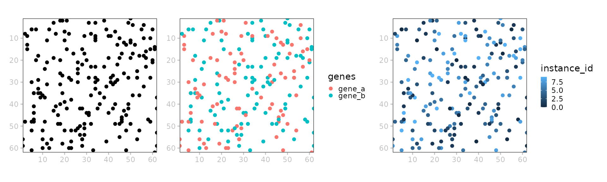
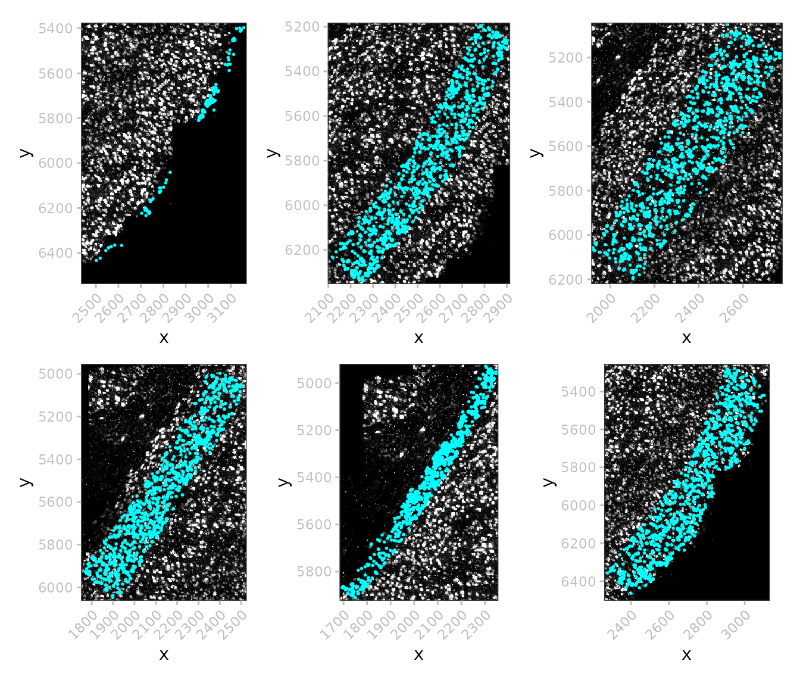
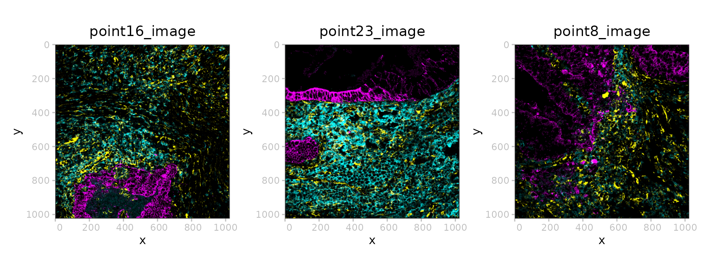
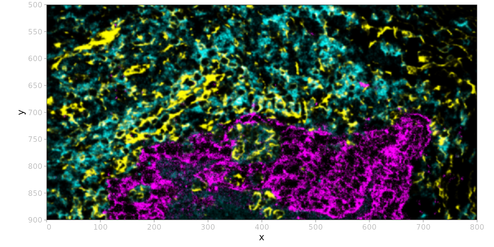

# \`SpatialData.plot\`

``` r

library(ggplot2)
library(patchwork)
library(ggnewscale)
library(SpatialData)
library(SpatialData.data)
library(SpatialData.plot)
library(SingleCellExperiment)
```

## Introduction

The `SpatialData` package contains a set of reader and plotting
functions for spatial omics data stored as
[SpatialData](https://spatialdata.scverse.org/en/latest/index.html)
`.zarr` files that follow [OME-NGFF
specs](https://ngff.openmicroscopy.org/latest/#image-layout).

Each `SpatialData` object is composed of five layers: images, labels,
shapes, points, and tables. Each layer may contain an arbitrary number
of elements.

Images and labels are represented as `ZarrArray`s
(*[Rarr](https://bioconductor.org/packages/3.23/Rarr)*). Points and
shapes are represented as
*[arrow](https://CRAN.R-project.org/package=arrow)* objects linked to an
on-disk *.parquet* file. As such, all data are represented out of
memory.

Element annotation as well as cross-layer summarizations (e.g., count
matrices) are represented as
*[SingleCellExperiment](https://bioconductor.org/packages/3.23/SingleCellExperiment)*
as tables.

``` r

x <- file.path("extdata", "blobs.zarr")
x <- system.file(x, package="SpatialData")
(x <- readSpatialData(x))
```

    ## class: SpatialData
    ## - images(2):
    ##   - blobs_image (3,64,64)
    ##   - blobs_multiscale_image (3,64,64)
    ## - labels(2):
    ##   - blobs_labels (64,64)
    ##   - blobs_multiscale_labels (64,64)
    ## - points(1):
    ##   - blobs_points (200)
    ## - shapes(3):
    ##   - blobs_circles (5,circle)
    ##   - blobs_multipolygons (2,polygon)
    ##   - blobs_polygons (5,polygon)
    ## - tables(1):
    ##   - table (3,10) [blobs_labels]
    ## coordinate systems(5):
    ## - global(8): blobs_image blobs_multiscale_image ... blobs_polygons
    ##   blobs_points
    ## - scale(1): blobs_labels
    ## - translation(1): blobs_labels
    ## - affine(1): blobs_labels
    ## - sequence(1): blobs_labels

## Visualization

#### Images

`Image/LabelArray`s are linked to potentially multiscale .zarr stores.
Their show method includes the scales available for a given element:

``` r

image(x, "blobs_image")
```

    ## class:  SpatialDataImage  
    ## Scales (1): (3,64,64)

``` r

image(x, "blobs_multiscale_image")
```

    ## class:  SpatialDataImage (MultiScale) 
    ## Scales (3): (3,64,64 3,32,32 3,16,16)

Internally, multiscale `ImageArray`s are stored as a list of
`ZarrArray`, e.g.:

``` r

i <- image(x, "blobs_multiscale_image")
vapply(data(i, k=NULL), dim, numeric(3))
```

    ##      [,1] [,2] [,3]
    ## [1,]    3    3    3
    ## [2,]   64   32   16
    ## [3,]   64   32   16

To retrieve a specific scale’s `ZarrArray`, we can use `data(., k)`,
where `k` specifies the target scale. This also works for plotting:

``` r

wrap_plots(nrow=1, lapply(seq(3), \(.) 
    plotSpatialData() + plotImage(x, i=2, k=.)))
```


#### Labels

``` r

i <- "blobs_labels"
t <- getTable(x, i)
t$id <- sample(letters, ncol(t))
table(x) <- t

p <- plotSpatialData()
pal_d <- hcl.colors(10, "Spectral")
pal_c <- hcl.colors(9, "Inferno")[-9]

a <- p + plotLabel(x, i, pal="grey")                   # binary
b <- p + plotLabel(x, i, c="id", pal=pal_d)            # metadata
c <- p + plotLabel(x, i, c="channel_1_sum", pal=pal_c) # assay

(a | b | c) + 
    plot_layout(guides="collect") & 
    theme(legend.position="bottom")
```


#### Points

``` r

i <- "blobs_points"
a <- p + plotPoint(x, i)
b <- p + plotPoint(x, i, col="genes")       # discrete
c <- p + plotPoint(x, i, col="instance_id") # continuous
(a | b | c) 
```



#### Shapes

``` r

p <- plotSpatialData()
a <- p +
  ggtitle("polygons") +
  plotShape(x, "blobs_polygons")
b <- p +
  ggtitle("multipolygons") +
  plotShape(x, "blobs_multipolygons")
c <- p +
  ggtitle("circles") +
  plotShape(x, "blobs_circles")
(a | b | c)
```


#### Layering

``` r

p <- plotSpatialData()
# joint
all <- p +
    plotImage(x) +
    plotLabel(x, a=1/3) +
    plotShape(x, 1) +
    plotShape(x, 3) +
    new_scale_color() +
    plotPoint(x, col="genes") +
    ggtitle("layered")
# split
one <- list(
    p + plotImage(x) + ggtitle("image"),
    p + plotLabel(x) + ggtitle("labels"),
    p + plotShape(x, 1) + ggtitle("circles"),
    p + plotShape(x, 3) + ggtitle("polygons"),
    p + plotPoint(x, col="genes") + ggtitle("points"))
wrap_plots(c(list(all), one), nrow=2)
```


## Examples

### MERFISH

In this example data, we do not have a `label` for the `shape` polygons.
Such labels could be morphological regions annotated by pathologists.

``` r

dir.create(td <- tempfile())
pa <- get_demo_SDdata("merfish")
```

``` r

(x <- readSpatialData(pa))
```

    ## class: SpatialData
    ## - images(1):
    ##   - rasterized (1,522,575)
    ## - labels(0):
    ## - points(1):
    ##   - single_molecule (3714642)
    ## - shapes(2):
    ##   - anatomical (6,polygon)
    ##   - cells (2389,circle)
    ## - tables(1):
    ##   - table (268,2389) [cells]
    ## coordinate systems(1):
    ## - global(4): rasterized anatomical cells single_molecule

There are only 2389 cells, but 3,714,642 molecules, so that we
downsample a random subset of 1,000 for visualization:

``` r

# layered visualization
plotSpatialData() +
    plotImage(x, c="white") +
    plotPoint(x, n=1e3, col="cell_type", size=0.5) +
    scale_color_manual(values=rainbow(8)) +
    guides(col=guide_legend(override.aes=list(size=2))) +
    plotShape(x, i="anatomical", fill=NA, col="white", linewidth=1) 
```


``` r

# subset & downsample for speed
y <- x[c("images", "points"), ]
n <- length(point(y))
i <- sample(n, 1e5)
point(y) <- point(y)[i]
# polygon queries
lapply(seq_along(shape(x)), \(s) {
    df <- data(shape(x)[s, ])
    z <- crop(y, sf::st_as_sf(df))
    plotSpatialData() + 
        plotImage(z) +
        plotPoint(z, n=1e3, size=1/3, col="cyan")
}) |> wrap_plots(nrow=2) & theme(axis.text.x=element_text(angle=45, hjust=1))
```



### MibiTOF

Colorectal carcinoma, 25 MB; no shapes, no points.

``` r

(x <- ColorectalCarcinomaMIBITOF())
```

    ## class: SpatialData
    ## - images(3):
    ##   - point16_image (3,1024,1024)
    ##   - point23_image (3,1024,1024)
    ##   - point8_image (3,1024,1024)
    ## - labels(3):
    ##   - point16_labels (1024,1024)
    ##   - point23_labels (1024,1024)
    ##   - point8_labels (1024,1024)
    ## - points(0):
    ## - shapes(0):
    ## - tables(1):
    ##   - table (36,3309) []
    ## coordinate systems(3):
    ## - point16(2): point16_image point16_labels
    ## - point23(2): point23_image point23_labels
    ## - point8(2): point8_image point8_labels

``` r

ps <- lapply(imageNames(x), \(i) plotSpatialData() + plotImage(x, i) + ggtitle(i))
wrap_plots(ps, nrow=1)
```



``` r

# bounding-box query
bb <- list(
    xmin=0, xmax=800, 
    ymin=500, ymax=900)
y <- crop(x["images", 1], bb)
plotSpatialData() + plotImage(y)
```



## Session info

    ## R version 4.6.0 (2026-04-24)
    ## Platform: x86_64-pc-linux-gnu
    ## Running under: Ubuntu 24.04.4 LTS
    ## 
    ## Matrix products: default
    ## BLAS:   /usr/lib/x86_64-linux-gnu/openblas-pthread/libblas.so.3 
    ## LAPACK: /usr/lib/x86_64-linux-gnu/openblas-pthread/libopenblasp-r0.3.26.so;  LAPACK version 3.12.0
    ## 
    ## locale:
    ##  [1] LC_CTYPE=C.UTF-8       LC_NUMERIC=C           LC_TIME=C.UTF-8       
    ##  [4] LC_COLLATE=C.UTF-8     LC_MONETARY=C.UTF-8    LC_MESSAGES=C.UTF-8   
    ##  [7] LC_PAPER=C.UTF-8       LC_NAME=C              LC_ADDRESS=C          
    ## [10] LC_TELEPHONE=C         LC_MEASUREMENT=C.UTF-8 LC_IDENTIFICATION=C   
    ## 
    ## time zone: UTC
    ## tzcode source: system (glibc)
    ## 
    ## attached base packages:
    ## [1] stats4    stats     graphics  grDevices utils     datasets  methods  
    ## [8] base     
    ## 
    ## other attached packages:
    ##  [1] SingleCellExperiment_1.34.0 SummarizedExperiment_1.42.0
    ##  [3] Biobase_2.72.0              GenomicRanges_1.64.0       
    ##  [5] Seqinfo_1.2.0               IRanges_2.46.0             
    ##  [7] S4Vectors_0.50.0            BiocGenerics_0.58.0        
    ##  [9] generics_0.1.4              MatrixGenerics_1.24.0      
    ## [11] matrixStats_1.5.0           SpatialData.plot_0.99.6    
    ## [13] SpatialData.data_0.99.6     SpatialData_0.99.35        
    ## [15] ggnewscale_0.5.2            patchwork_1.3.2            
    ## [17] ggplot2_4.0.3               BiocStyle_2.40.0           
    ## 
    ## loaded via a namespace (and not attached):
    ##   [1] DBI_1.3.0           bitops_1.0-9        RBGL_1.88.0        
    ##   [4] httr2_1.2.2         anndataR_1.2.0      rlang_1.2.0        
    ##   [7] magrittr_2.0.5      Rarr_2.0.0          RSQLite_2.4.6      
    ##  [10] e1071_1.7-17        compiler_4.6.0      dir.expiry_1.20.0  
    ##  [13] paws.storage_0.9.0  png_0.1-9           systemfonts_1.3.2  
    ##  [16] fftwtools_0.9-11    vctrs_0.7.3         pkgconfig_2.0.3    
    ##  [19] wk_0.9.5            crayon_1.5.3        fastmap_1.2.0      
    ##  [22] dbplyr_2.5.2        XVector_0.52.0      labeling_0.4.3     
    ##  [25] paws.common_0.8.9   rmarkdown_2.31      graph_1.90.0       
    ##  [28] ragg_1.5.2          bit_4.6.0           purrr_1.2.2        
    ##  [31] xfun_0.57           cachem_1.1.0        jsonlite_2.0.0     
    ##  [34] blob_1.3.0          DelayedArray_0.38.1 uuid_1.2-2         
    ##  [37] tweenr_2.0.3        jpeg_0.1-11         tiff_0.1-12        
    ##  [40] parallel_4.6.0      R6_2.6.1            bslib_0.10.0       
    ##  [43] RColorBrewer_1.1-3  reticulate_1.46.0   jquerylib_0.1.4    
    ##  [46] assertthat_0.2.1    Rcpp_1.1.1-1.1      bookdown_0.46      
    ##  [49] knitr_1.51          R.utils_2.13.0      Matrix_1.7-5       
    ##  [52] tidyselect_1.2.1    duckspatial_1.0.0   abind_1.4-8        
    ##  [55] yaml_2.3.12         EBImage_4.54.0      curl_7.1.0         
    ##  [58] lattice_0.22-9      tibble_3.3.1        withr_3.0.2        
    ##  [61] S7_0.2.2            evaluate_1.0.5      desc_1.4.3         
    ##  [64] sf_1.1-1            BiocFileCache_3.2.0 units_1.0-1        
    ##  [67] proxy_0.4-29        polyclip_1.10-7     pillar_1.11.1      
    ##  [70] BiocManager_1.30.27 filelock_1.0.3      KernSmooth_2.23-26 
    ##  [73] RCurl_1.98-1.18     nanoarrow_0.8.0     scales_1.4.0       
    ##  [76] class_7.3-23        glue_1.8.1          tools_4.6.0        
    ##  [79] locfit_1.5-9.12     fs_2.1.0            grid_4.6.0         
    ##  [82] duckdb_1.5.2        basilisk_1.24.0     ggforce_0.5.0      
    ##  [85] cli_3.6.6           rappdirs_0.3.4      textshaping_1.0.5  
    ##  [88] S4Arrays_1.12.0     arrow_24.0.0        dplyr_1.2.1        
    ##  [91] geoarrow_0.4.2      gtable_0.3.6        R.methodsS3_1.8.2  
    ##  [94] sass_0.4.10         digest_0.6.39       classInt_0.4-11    
    ##  [97] SparseArray_1.12.2  ZarrArray_1.0.0     htmlwidgets_1.6.4  
    ## [100] farver_2.1.2        memoise_2.0.1       htmltools_0.5.9    
    ## [103] pkgdown_2.2.0       R.oo_1.27.1         lifecycle_1.0.5    
    ## [106] bit64_4.8.0         MASS_7.3-65
