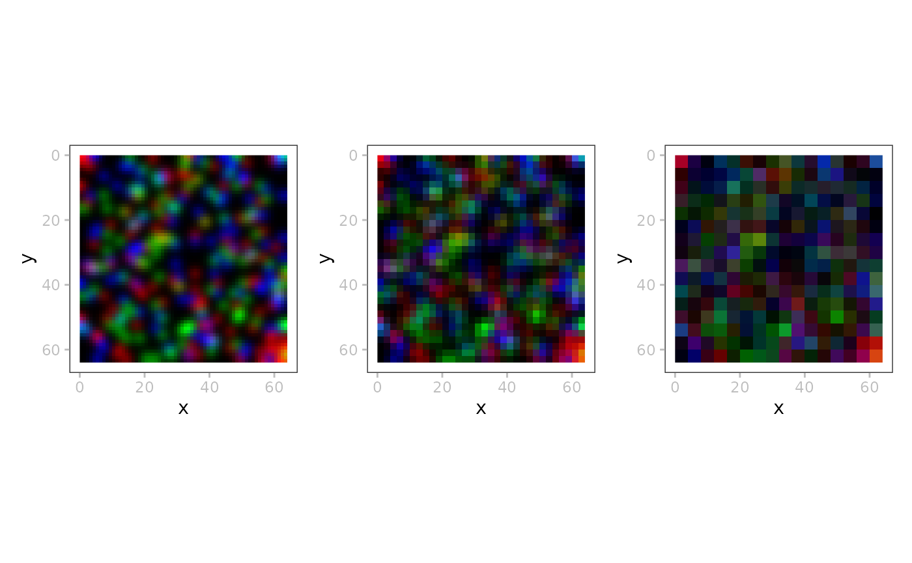
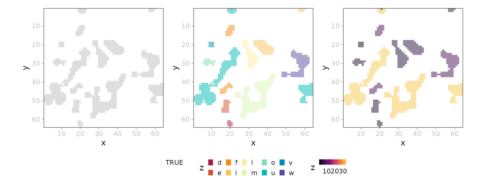
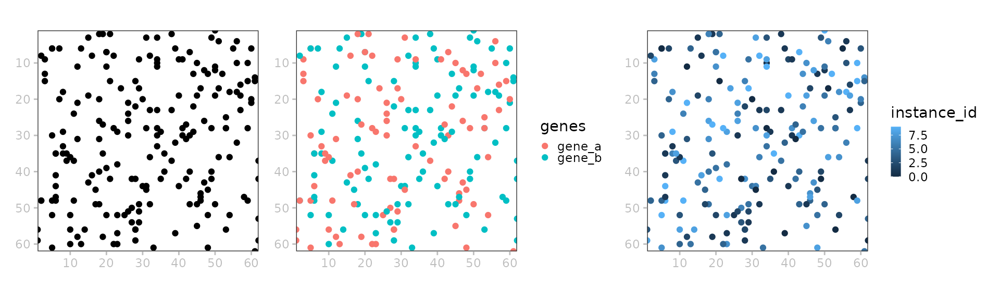
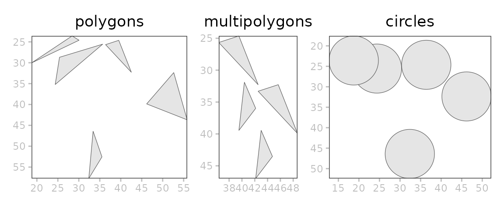
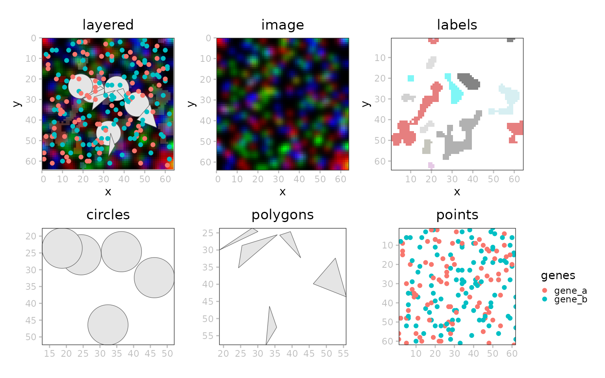

# \`SpatialData.plot\`

Abstract

`SpatialData.plot` provides a visualization suit for `SpatialData`
objects in `ggplot2`-style, with support for multi-scale `images` and
`labels`, `points` and `shapes`, and layering of elements into composite
plots. For the latter, POINT, POLYGON, and MULTIPOLYGON geometries are
supported. For all but `images`, there is support to pass information
from annotation `tables` as aesthetics (e.g., `colData` or `assay`
data). For `images`, auto-contrasting and multi-channel color merging
are supported. Each layer returns a standard `ggplot` object, allowing
for customization (e.g., using `ggnewscale` for layer-specific
fill/color scales), or multi-panel arrangement (e.g., using
`patchwork`).

## Installation

`SpatialData.plot` can be installed as follows:

``` r

if (require("BiocManager", quietly=TRUE))
    install.packages("BiocManager")
BiocManager::install("SpatialData.plot")
```

For the purpose of this vignette, we require the following dependencies:

``` r

library(ggplot2)
library(patchwork)
library(ggnewscale) 
library(spatialdataR)
library(SpatialData.plot)
```

## Introduction

The `SpatialData.plot` package contains a set of plotting functions for
spatial omics data stored as
[SpatialData](https://spatialdata.scverse.org/en/latest/index.html)
`.zarr` files that follow [OME-NGFF
specs](https://ngff.openmicroscopy.org/latest/#image-layout). Each
`SpatialData` object is composed of five layers: images, labels, shapes,
points, and tables. Each layer may contain an arbitrary number of
elements. Images and labels are represented as `ZarrArray`s
(*[Rarr](https://bioconductor.org/packages/3.24/Rarr)*). Points and
shapes are represented as
*[arrow](https://CRAN.R-project.org/package=arrow)* objects linked to an
on-disk *.parquet* file. As such, all data are represented out of
memory. Element annotation as well as cross-layer summarizations (e.g.,
count matrices) are represented as
*[SingleCellExperiment](https://bioconductor.org/packages/3.24/SingleCellExperiment)*
as tables.

**We here demonstrate package functionality using a trivial example
dataset. For more realistic technology-focused examples, we refer
readers to the companion [demo
website](https://helenalc.github.io/SpatialData.demo).**

``` r

x <- file.path("extdata", "blobs.zarr")
x <- system.file(x, package="spatialdataR")
(x <- readSpatialData(x))
```

    ## class: SpatialData
    ## - images(2):
    ##   - blobs_image (3,64,64)
    ##   - blobs_multiscale_image (3,64,64)
    ## - labels(2):
    ##   - blobs_labels (64,64)
    ##   - blobs_multiscale_labels (64,64)
    ## - points(1):
    ##   - blobs_points (200)
    ## - shapes(3):
    ##   - blobs_circles (5,circle)
    ##   - blobs_multipolygons (2,polygon)
    ##   - blobs_polygons (5,polygon)
    ## - tables(1):
    ##   - table (3,10) [blobs_labels]
    ## coordinate systems(5):
    ## - global(8): blobs_image blobs_multiscale_image ... blobs_polygons
    ##   blobs_points
    ## - scale(1): blobs_labels
    ## - translation(1): blobs_labels
    ## - affine(1): blobs_labels
    ## - sequence(1): blobs_labels

## Visualization

`SpatialData.plot` provides 5 user-facing plotting functions:

- [`plotSpatialData()`](https://HelenaLC.github.io/SpatialData.plot/reference/plotImage.md)
  renders a base (blank) `ggplot` with simple aesthetics and,
  importantly, a fixed axial ratio as to not distort spatial
  coordinates.
- `plotImage/Label/Point/Shape()` render specific `SpatialData`
  elements; each requires specification of the element index/name `i`,
  and coordinate system `j` (by default, the first available
  element/system will be rendered); different functions further accept
  different arguments to control aesthetics.

### Images

`Image/LabelArray`s are linked to potentially multiscale .zarr stores.
Their show method includes the scales available for a given element:

``` r

image(x, "blobs_image")
```

    ## class:  SpatialDataImage  
    ## Scales (1): (3,64,64)

``` r

image(x, "blobs_multiscale_image")
```

    ## class:  SpatialDataImage (MultiScale) 
    ## Scales (3): (3,64,64 3,32,32 3,16,16)

Internally, multiscale `ImageArray`s are stored as a list of
`ZarrArray`, e.g.:

``` r

i <- image(x, "blobs_multiscale_image")
vapply(data(i, k=NULL), dim, numeric(3))
```

    ##      [,1] [,2] [,3]
    ## [1,]    3    3    3
    ## [2,]   64   32   16
    ## [3,]   64   32   16

To retrieve a specific scale’s `ZarrArray`, we can use `data(., k)`,
where `k` specifies the target scale. This also works for plotting:

``` r

wrap_plots(nrow=1, lapply(seq(3), \(.) 
    plotSpatialData() + plotImage(x, i=2, k=.)))
```



### Labels

Like `image`s, `label`s are represented as `ZarrArray`. Array values,
however, are integers that correspond to different instances, typically
linked to a `table` of annotations (e.g., expression values, observation
metadata, etc.).

``` r

i <- "blobs_labels"
t <- getTable(x, i)
t$id <- sample(letters, ncol(t))
table(x) <- t

p <- plotSpatialData()
pal_d <- hcl.colors(10, "Spectral")
pal_c <- hcl.colors(9, "Inferno")[-9]

a <- p + plotLabel(x, i, pal="grey")                   # binary
b <- p + plotLabel(x, i, c="id", pal=pal_d)            # metadata
c <- p + plotLabel(x, i, c="channel_1_sum", pal=pal_c) # assay

(a | b | c) + 
    plot_layout(guides="collect") & 
    theme(legend.position="bottom")
```



### Points

Elements of the `points` layer are rendered using
[`geom_point()`](https://ggplot2.tidyverse.org/reference/geom_point.html),
and accepts both discrete and continuous color specifications.

``` r

i <- "blobs_points"
a <- p + plotPoint(x, i)
b <- p + plotPoint(x, i, col="genes")       # discrete
c <- p + plotPoint(x, i, col="instance_id") # continuous
(a | b | c) 
```



### Shapes

For demonstration, we render each `shape` element present in the object,
which includes all possible types: circles and (multi)polygons.

``` r

p <- plotSpatialData()
a <- p +
  ggtitle("polygons") +
  plotShape(x, "blobs_polygons")
b <- p +
  ggtitle("multipolygons") +
  plotShape(x, "blobs_multipolygons")
c <- p +
  ggtitle("circles") +
  plotShape(x, "blobs_circles")
(a | b | c)
```



### Layering

Several `SpatialData` elements (images, labels, points, shapes) can be
layered on-top of each other in `ggplot`-style using the `+`-operator.
The return value of each such call remains a `ggplot` object, which
accepts additional aesthetics. Note that specifying layer-specific
fill/color requires setting up a new scale with
`ggnewscale::new_scale_fill/color()`; an example is as follows:

``` r

p <- plotSpatialData()
# joint
all <- p +
    plotImage(x) +
    plotLabel(x, a=1/3) +
    plotShape(x, 1) +
    plotShape(x, 3) +
    new_scale_color() +
    plotPoint(x, col="genes") +
    ggtitle("layered")
# split
one <- list(
    p + plotImage(x) + ggtitle("image"),
    p + plotLabel(x) + ggtitle("labels"),
    p + plotShape(x, 1) + ggtitle("circles"),
    p + plotShape(x, 3) + ggtitle("polygons"),
    p + plotPoint(x, col="genes") + ggtitle("points"))
wrap_plots(c(list(all), one), nrow=2)
```



## Session info

    ## R Under development (unstable) (2026-10-05 r90641)
    ## Platform: x86_64-pc-linux-gnu
    ## Running under: Ubuntu 24.04.5 LTS
    ## 
    ## Matrix products: default
    ## BLAS:   /usr/lib/x86_64-linux-gnu/openblas-pthread/libblas.so.3 
    ## LAPACK: /usr/lib/x86_64-linux-gnu/openblas-pthread/libopenblasp-r0.3.26.so;  LAPACK version 3.12.0
    ## 
    ## locale:
    ##  [1] LC_CTYPE=C.UTF-8       LC_NUMERIC=C           LC_TIME=C.UTF-8       
    ##  [4] LC_COLLATE=C.UTF-8     LC_MONETARY=C.UTF-8    LC_MESSAGES=C.UTF-8   
    ##  [7] LC_PAPER=C.UTF-8       LC_NAME=C              LC_ADDRESS=C          
    ## [10] LC_TELEPHONE=C         LC_MEASUREMENT=C.UTF-8 LC_IDENTIFICATION=C   
    ## 
    ## time zone: UTC
    ## tzcode source: system (glibc)
    ## 
    ## attached base packages:
    ## [1] stats     graphics  grDevices utils     datasets  methods   base     
    ## 
    ## other attached packages:
    ## [1] SpatialData.plot_0.99.7 spatialdataR_0.99.44    ggnewscale_0.5.2       
    ## [4] patchwork_1.3.2         ggplot2_4.0.3           BiocStyle_2.41.0       
    ## 
    ## loaded via a namespace (and not attached):
    ##  [1] tidyselect_1.2.1            grumpy_0.1.1               
    ##  [3] blob_1.3.0                  dplyr_1.2.1                
    ##  [5] farver_2.1.2                R.utils_2.13.0             
    ##  [7] S7_0.2.2                    fastmap_1.2.0              
    ##  [9] SingleCellExperiment_1.35.2 duckdb_1.5.6               
    ## [11] tweenr_2.0.3                digest_0.6.39              
    ## [13] lifecycle_1.0.5             sf_1.1-3                   
    ## [15] paws.storage_0.10.0         magrittr_2.0.5             
    ## [17] compiler_4.7.0              rlang_1.3.0                
    ## [19] sass_0.4.10                 tools_4.7.0                
    ## [21] yaml_2.3.12                 knitr_1.52                 
    ## [23] labeling_0.4.3              S4Arrays_1.13.2            
    ## [25] classInt_0.4-11             curl_8.0.0                 
    ## [27] reticulate_1.47.0           DelayedArray_0.39.8        
    ## [29] RColorBrewer_1.1-3          abind_1.4-8                
    ## [31] KernSmooth_2.23-27          withr_3.0.3                
    ## [33] purrr_1.2.2                 BiocGenerics_0.59.12       
    ## [35] desc_1.4.3                  R.oo_1.27.1                
    ## [37] polyclip_1.10-7             grid_4.7.0                 
    ## [39] stats4_4.7.0                e1071_1.7-17               
    ## [41] MASS_7.3-66                 scales_1.4.0               
    ## [43] SummarizedExperiment_1.43.0 cli_3.6.6                  
    ## [45] rmarkdown_2.32              crayon_1.5.3               
    ## [47] ragg_1.5.2                  generics_0.1.4             
    ## [49] otel_0.2.0                  ggforce_0.5.0              
    ## [51] DBI_1.3.0                   cachem_1.1.0               
    ## [53] proxy_0.4-29                BiocManager_1.30.27        
    ## [55] XVector_0.53.0              matrixStats_1.5.0          
    ## [57] vctrs_0.7.3                 Matrix_1.7-6               
    ## [59] jsonlite_2.0.0              bookdown_0.48              
    ## [61] IRanges_2.47.5              S4Vectors_0.51.10          
    ## [63] RBGL_1.89.0                 systemfonts_1.3.2          
    ## [65] jquerylib_0.1.4             units_1.0-1                
    ## [67] glue_1.8.1                  pkgdown_2.2.1              
    ## [69] ZarrArray_1.1.7             gtable_0.3.6               
    ## [71] Rarr_2.1.43                 GenomicRanges_1.65.4       
    ## [73] tibble_3.3.1                pillar_1.11.1              
    ## [75] htmltools_0.5.9             Seqinfo_1.3.2              
    ## [77] graph_1.91.0                dbplyr_2.6.0               
    ## [79] R6_2.6.1                    httr2_1.3.0                
    ## [81] wk_0.9.5                    textshaping_1.0.5          
    ## [83] evaluate_1.0.5              lattice_0.23-1             
    ## [85] Biobase_2.73.2              R.methodsS3_1.8.2          
    ## [87] png_0.1-9                   duckspatial_1.2.1          
    ## [89] paws.common_0.9.0           bslib_0.12.0               
    ## [91] class_7.3-24                uuid_1.2-2                 
    ## [93] Rcpp_1.1.2                  SparseArray_1.13.4         
    ## [95] anndataR_1.3.2              xfun_0.61                  
    ## [97] fs_2.1.0                    MatrixGenerics_1.25.0      
    ## [99] pkgconfig_2.0.3
